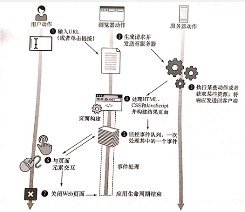
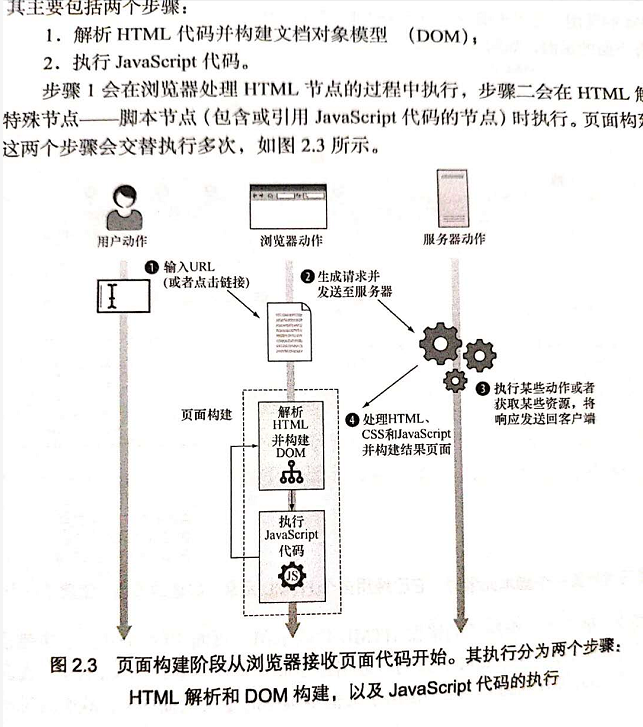
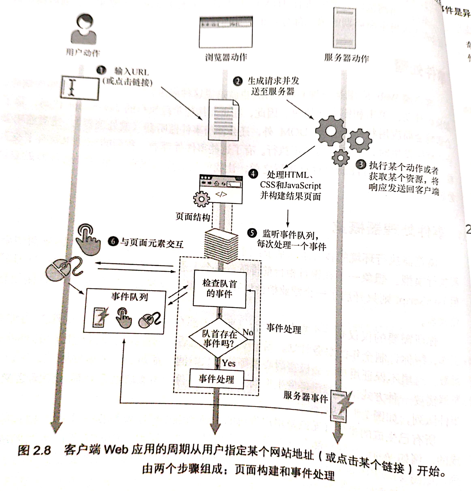

## 第二章 运行时的页面构建过程

### 2.1 生命周期概览

## 图2.1 客户端Web应用的周期从用户指定某网站地址（或单机某个链接）开始，由两个步骤组成：页面构建和事件处理

### 2.2 页面构建阶段

#### 2.2.1 HTML 解析和DOM构建

#### 2.2.2 执行Javascript代码
只要还有没处理完的HTML代码和没执行玩的Javascript代码，下面两个两个步骤都会一直交替执行。
1. 将HTML构建为DOM
2. 执行Javascript代码
最后，当浏览器处理完所以HTML元素后，页面构建阶段就结束了。随后浏览器就会进入应用生命周期的第二部分：事件处理。

### 2.3 事件处理
    客户端Web应用是一种GUI应用，也就是说这种应用会对不同类型的事件作响应。

#### 2.3.1 事件处理器概览
    浏览器执行环境的核心思想基于：同一时刻只能执行一个代码片段，即所谓的单线程执行模型。想象一下在银行柜台前排队，每个人进人一支队伍等待叫号并“处理”。但JavaScript则只开启了一个营业柜台！每当轮到某个顾客时（某个事件），只能处理该位顾客。你所需要的仅仅是一个在营业柜台（所有人都在这个柜台排队！）的职员为你处理工作，帮你订制全年的财务计划。当一个事件抵达后，浏览器需要执行相应的事件处理函数。这里不保证用户总会极富耐心地等待很长时间，直到下一个事件触发。所以，浏览器需要一种方式来跟踪已经发生但尚未处理的事件。为实现这个目标，浏览器使用了事件队列，如图2.8所示。所有已生成的事件（无论是用户生成的，例如鼠标移动或键盘按压；还是服务器生成的，例如 Ajax事件）都会放在同一个事件队列中，以它们被浏览器检测到的顺序排列。如图2.8的中部所示，事件处理的过程可以描述为一个简单的流程图。

> + 浏览器检查事件队列头；
> + 如果浏览器没有在队列中检查到事件，则继续检查
> + 如果浏览器再队列头中检查到了事件，则取出该事件并执行相应的事件处理器（如果存在）。在这个过程中，余下的事件队列中耐心等待，直到轮到它们被处理。

    重点注意浏览器在这个过程中的机制，其放查事件的队列是在页面构建阶段和事件
    处理阶段以外的。这个过程对于决定事件何的发生开符其推人事件队列很重要，这个过
    程不会参与事件处理线程。
**事件是异步的**
    